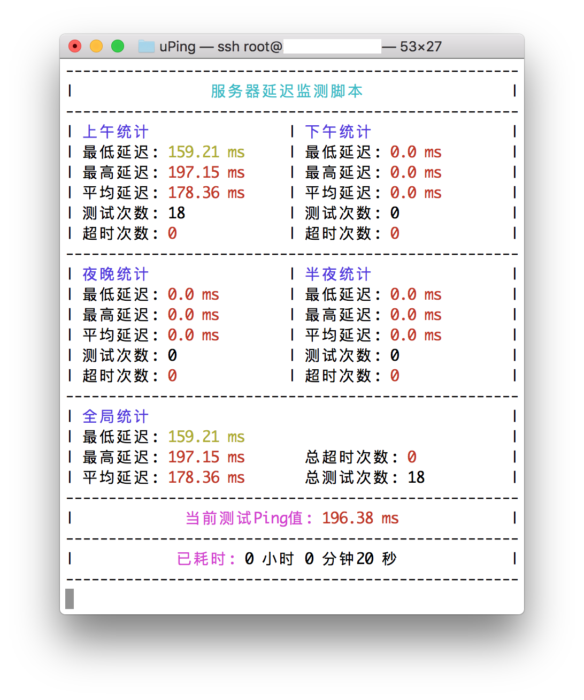

# uPing
一个24小时监测VPS延迟的工具

## 警告

目前正在测试阶段，请勿用于生产环境！

## 依赖安装

Debian / Ubuntu :

    apt-get update
    apt-get install python wget screen -y

CentOS / RHEL :
  
    yum install screen wget python -y

## 使用方法

    screen -S uping
    wget -N --no-check-certificate https://raw.githubusercontent.com/FunctionClub/uPing/master/uping.py
    python uping.py
  
## 截图

  
